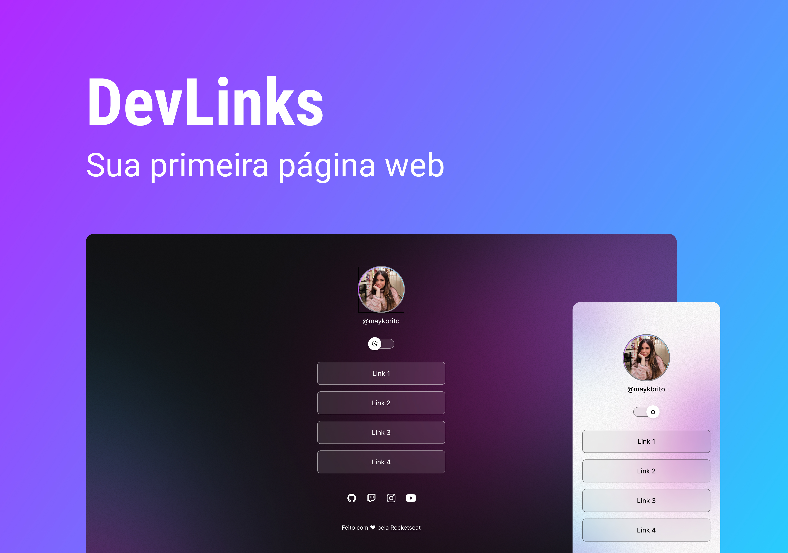

<h1 align="center"> DevLinks </h1>

<h4 align="center"> 
	 Status: Finalizado
</h4>

<a href="#-projeto">Projeto</a>&nbsp;&nbsp;&nbsp;|&nbsp;&nbsp;&nbsp;
  <a href="#-tecnologias-utilizadas">Tecnologias Utilizadas</a>&nbsp;&nbsp;&nbsp;|&nbsp;&nbsp;&nbsp;
    <a href="#-layout">Layout</a>&nbsp;&nbsp;&nbsp;|&nbsp;&nbsp;&nbsp;
 

 

  

## Sobre
 

O DevLinks é um agregador de links para usar como cartão de visitas online. O agregador foi desenvolvido a partir de um evento da [Rocketseat](https://lp.rocketseat.com.br/devlinks/inscricao?utm_source=github&utm_medium=descricao&utm_campaign=capture-devlinks&utm_term=organic&utm_content=descricao-github-mayk-brito).

- [Acesse o projeto finalizado, online](https://maykbrito.github.io/devlinks)

---

## Tecnologias Utilizadas
 

-  HTML

-  CSS

-  JavaScript

-  GitHub

-  GIT

-  Figma

---

## Layout

Você pode visualizar o layout do projeto desenvolvido pela Rocketseat através [DESSE LINK](https://www.figma.com/community/file/1187422022288947321). 

---

  

